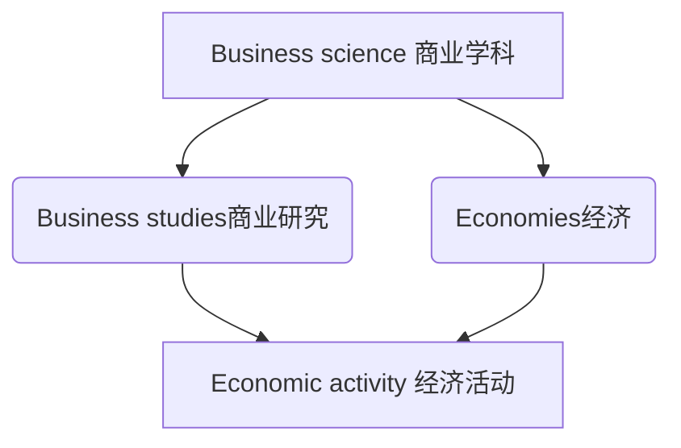
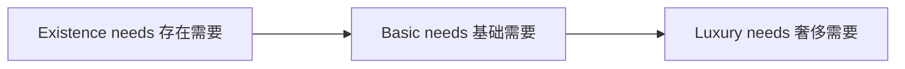
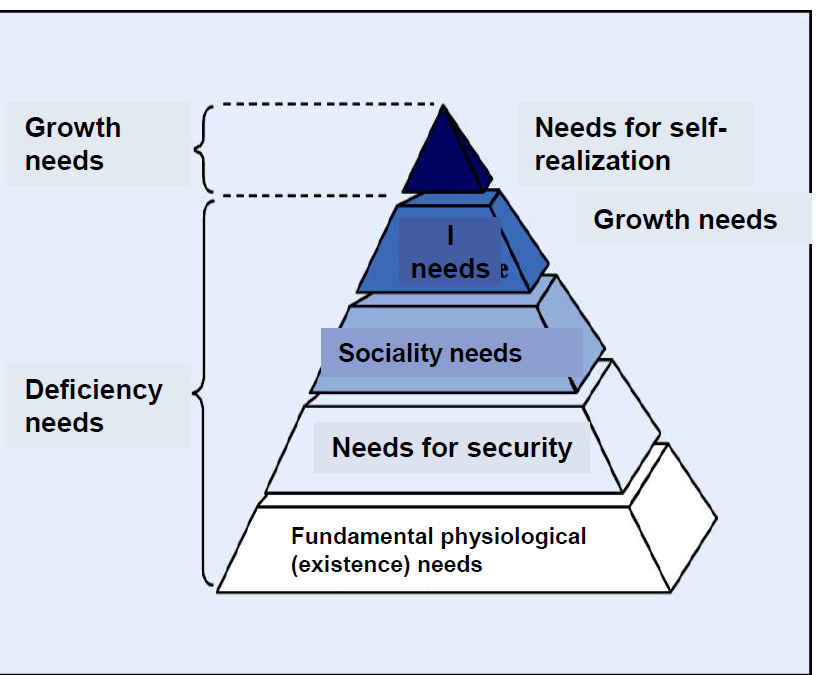

# Definition of business studies 商业研究的定义

## Business studies 商业研究

A **descriptive** and **decision** **oriented** sub-discipline of business sciences that investigates the structures and processes of individual companies or households and deviates recommendations for target oriented economic behavior patterns on the basis of the recognized rules and regulations

经济学的描述性和决策性子学科，研究个体企业或家庭的结构和过程，并基于公认的规则和规律性得出针对目标经济行为的建议.

## Economic models 经济模型

模型是抽象并简化的。

### 分类

#### investigation purpose 根据调查情况

**Descriptive models 叙述性模型**: Model actions on the basis of experience without analyzing and explaining them (e.g. accounting）不经过分析和解释的模型，比如会计

**Explanatory models 扩展模型**:  Explain verbally or visual the causes of operational processes including the underlying principles (e.g. production and cost theory)用可视化来解释潜在的原因

**Decision models 决策模型**: Are looking for means for optimal target realization. 找到最好的解决方法

#### result structure 根据结果结构

**deterministic and stochastic确定和随机**

**Static and dynamic 动态和静态**

**Analytic and simulation models 分析和模拟模型**

## Economic fundamental terms 经济基础事项

经济可以满足需要

经济的任务：通过提供对应的补给来满足人的需求

### Economic activity 经济活动

All systematic human activities with the target to reduce the scarcity of goods measured by the needs of people. 所有的系统性的人类活动的目标是通过测量人的需要减少物品的缺少。

#### Needs 需要

Objectively existing or subjectively perceived scarcities of the people. 人们客观上存在或者主观上认为的稀缺。

存在需要：让自己生存下来的需要，比如食物，衣服等

基础需要：不是基础生存，文化或者社交的也是生活一部分的。比如剧院，电影

奢侈需要：为了显示出自己差异的需求的提升。比如名牌包，奢侈品，珠宝

马斯洛金字塔如图

基本准则是：只有下层的需要被满足的时候，上层的需要才会开始。

* 尽管缺乏需要（deficiency need ）可以被满足但是还会再次出现。比如说饥饿
* 不满足缺乏需要会导致身体或者心理疾病
* 只有当缺乏需要被满足的时候，人才能开始自我实现。
* 增长的需要不可能完全被满足，因为它基于发展，是根本的限制

### Demand 需求

Demand = Desire for buying a certain good oder service in order to satisfy a human
need
需求为了满足需要而是想买特定的物品或者服务

Need = Demand supported by purchasing power.
需要是被购买力支撑的需求

**need**

* Desires of humans 人的欲望
* available indefinitely  无限可用
* Reason for action 行动的原因
* * I am hungry. *

**Demand 1**

* 一部分能够被市场满足
* 购买力存在了
* *心情不错，想要买个披萨奖励自己*

**Demand 2**

* 实在的商品
* 确实买下来了
* 在市场中需求存在
* *我买下了一个披萨*

### 商品的分类

#### 免费商品

不用付钱的商品，每个人都免费（空气，太阳等）

#### 经济商品

商品首先要被制造或者购买

