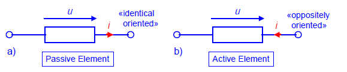
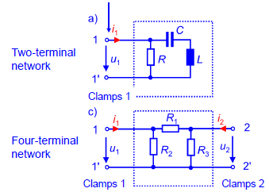
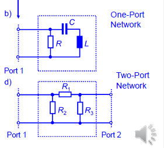
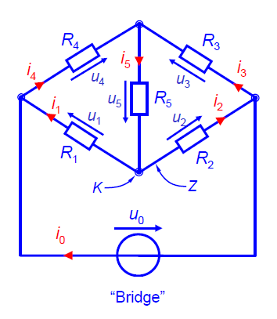
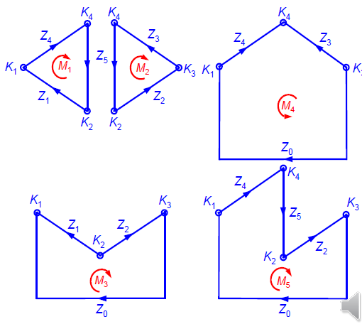
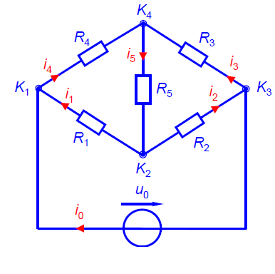

# Electric Circuits and Networks 电子电路和电网络

## Arrows of Reference 参考箭头

### Symbol of Network Elements 电路元件符号

电流和电压都是标量(scalar quantities).

但是在分析电流和电压时候，推荐使用参考箭头。他们在分析正确的符号时候很有必要

无源元件电压电流方向一致

有源元件电压电流方向相反

## Topologic Terminology 拓扑术语

### Electric Network Elements 电路元件

#### Symbol and  Connection 符号与链接

连接元件的权限控制于**锁头clamps**

元件通过锁头连入电路

有有源和无源的电路

#### 电路元件

##### 无源元件

* 电阻
* 电感
* 电容

##### 有源元件

* 理想电压源
* 理想电流源
* 控制电压源
* 控制电流源

### Electric network 电路

#### Access to Electric networks 连入电路权限

##### 低频电路

两个锁头可以定义两个终端 = =

（直译）

##### 高频电路

中间区域给电磁波留一个入端口

~~我感觉就是虚线和实现的区别~~

### Consider on an Exemplary Network 考虑示例网络

节点(node): 电路通过锁头(clamps)连接
实心圆点叫做**节点(node)**,就是锁头
对应图片中的K

分支(branch):  两个节点之间的连接线就是branch 
对应图片中的Z

电流$i$和电压$u$在电源处方向相反

对于所有无源元件电流方向可以随意挑选

所有无源元件的方向箭头应该和branch平行

对于一个拓扑结构的电路是被一个**有向图(digraph)**表示。电路中的元件都被直线代替

节点数字K是任意计数的

分支Z包含着电流箭头，也是任意计数

任意分支构成的闭环被称作**子网(Mesh)**

在子网中分支数等于节点数

 我们称子网的集合中，对于每个子网都最少有一条其他子网不包含的分支，我们称这样的子网叫做线性独立的

线性独立子网数公式

$$
m = z - k + 1 \\
其中z是分支数，k是节点数
$$

## 基尔霍夫定理

### 电流定理

在一个节点上的电流的总和为零

也就是一个节点上的出度和入度为0

#### Example 例子

$$
i_0 +i_1\         -i_4     = 0\\
     -i_1-i_2         +i_5 = 0\\
-i_0     +i_2-i_3          = 0\\
              i_3+i_4 -i_5 = 0
$$
有加必有减，总和一定为零，不论是总的电路还是每个节点

这四个方程中任意三个都是线性独立的

### 电压定理

任意子网中的电压和等于0

## Branch Current Analysis 分支电流分析

步骤

1. 数节点
2. 数分支，画电流方向
3. 根据规定在分支上画电压方向
4. 数子网，做总结
5. 写分支电流方程，不需要将能表达出来的单独列出
6. 写分支电压方程
7. 将电压方程写开，并将已知的量写出来
8. 将方程转化为矩阵相乘，解出矩阵

