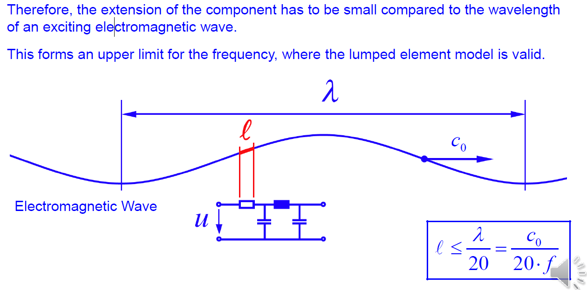
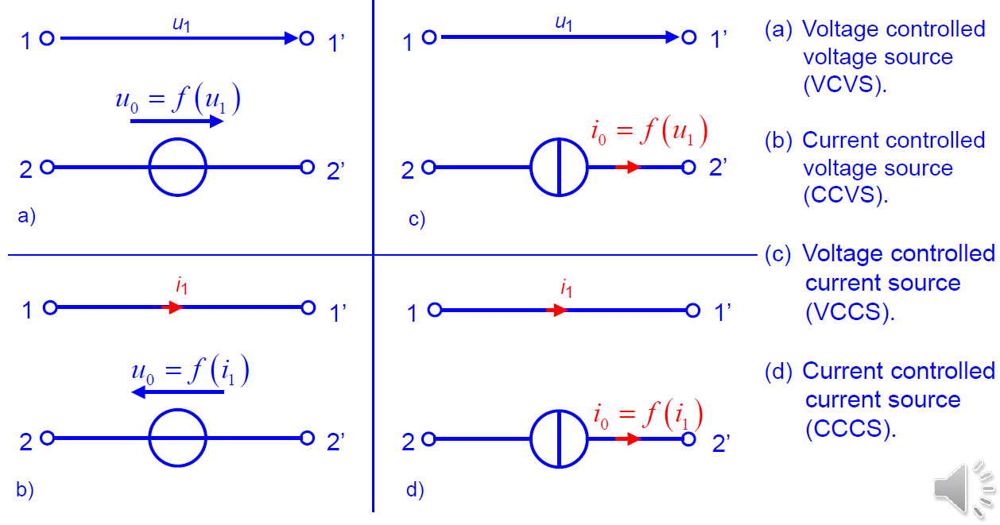
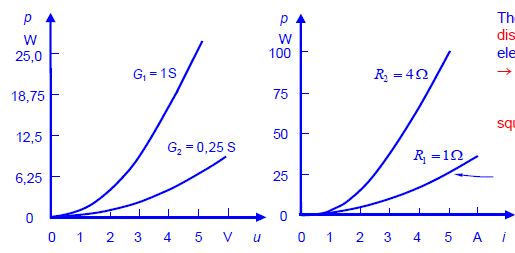
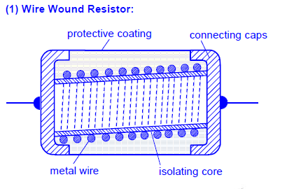
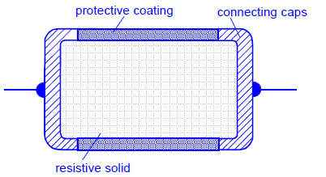
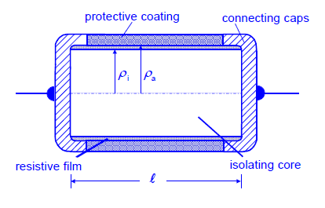
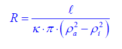
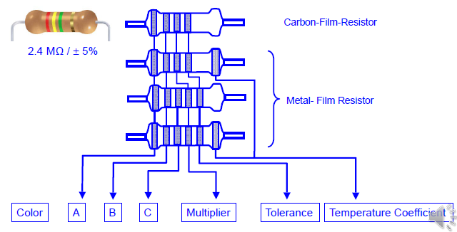
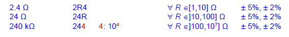

# Elements and Components

## General Remarks

电路通常是**集总电路模型(lumped element model)**

|集总参数电路是说电路的几何尺寸远小于工作时候的电磁波波长。

特点是 电路中电磁现象分别集中在各元件上或者是各个空间上，电流的移动不需要时间，同一根导线上的电流处处相等|

电路通常由两个部分组成：

1. 电元件
2. 两个电元件的连接部分，对于不包括一部分电阻(resistance)，电感(inductance)，电容(capacitance)的理想导体

电元件产生(yield)一个关于电压和电流的函数关系，它具有物理上不存在的理想的特性。

|分布参数电路中的电流电压不仅是时间的函数，还是空间坐标的函数|

它构成电器网络的基本组成部分

有五个基础的电元件：

1. 电阻（理想电阻器，即符合欧姆定律的电阻器） |耗能集中|
2. 电容（理想电容器）|电能集中|
3. 电感（理想电感）|磁能集中|
4. （理想）电流源
5. （理想）电势源

其它的元件也可以被定义，但应该由这五个元件组成

**电气组件(An electric component (device))**是电器件的物理实现。它拥有一些非理想特性。它的特性可以通过用理想电器件组成的等效电路实现

***

一个实际电路可能有多个电路模型

不同的器件可以有相同的模型

电路处理的是信号，信号会有频率，频率会有宽频不同调制信号

### Classification of Elements 电器件的分类

**有源元件(An active element)** 为电路提供电能

注意： 有源元件经常被叫做起源(sources),但是，并没有给起源的能量，能量只能被转换。

**无源元件(A Passive element)** 从电路中消耗能量。

注意：如果有器件暂时存放能量，稍后也会把能量用在电路中，该器件也被视作无源元件

#### Linear and Non-Linear Elements 线性和非线性元件

线性元件符合叠加原理(The principle of superposition) 即 $i_1 = f(u_1)$,$i_2 = f(u_2)$,那么就有$f(u_1+u_2) = f(u_1)+f(u_2)$

非线性元件不考虑^

|

#### Linear and Non-Linear Circuit 线性和非线性电路*

描述电路特性的所有方程都是线性代数或者是微积分就是线性电路。

线性电路是完全由线性元件、独立元、线性受控源构成的电路。

### Proportion of electric components 电器件的组成

为了满足集总电路模型的假设，场量应该是常数

电磁激励？？？

实际电路的几何储存远小于其工作电磁波的波长$\lambda$时，可以认为传送的电路各处的电磁能量同时到达，整个电路为电磁空间的一个点
$$
\lambda = \frac{c}{f} \\
c是光速，f是频率
$$
电磁激励使得频率有了上限，集总电路模型是可行的

## Electric Connections

### Ideal Connection

理想链接由实线表示，可以有弯折

junctions (交叉)

理想导线没有电阻，并且可以没有电压降的携带电流

### Real Connection

大多数导线由金属制成

highly doped semiconductor

所有线缆都会产生电阻，以电流承载有上限，会以热的形式损失能量

### Ideal Sources 理想电源

#### (1) 理想电压源

符号

#### (2) 理想电流源

注意电流和电压的方向在电源内和电源外的方向相反

### (Ideal) Dependent (or Controlled) Sources （理想）独立（或控制）源

### Real Voltage Sources 真实电压源

电源来自于其他的转换为电的能量

真正的电压依赖很多或者一部分电流（和理想电压源相反）

来源：

* 化学能——电池
* 机械能——发电机
* 电能——转换
* 其它——太阳能，生物能，潮汐发电

#### battery 电池

电池使用发生在电极(electrodes)和电解质(electrolyte)之间的化学反应来生成能量

#### Types of battery 电池的种类

* 一次性电池(Primary (disposable) batteries)

  化学反应不可逆
  只能使用一次
  类型：
  锌碳电池(Zinc-carbonbattery)
  碱性电池(Alkaline battery)

* 可充电电池(Secondary(rechargeable)batteries)

  化学反应可逆
  反复使用

  类型：NiCd Batteries, Ni-metal hybride (NiMH) batteries, Li-ion-batteries, Lead-acid
  batteries

#### Generators 发电机

电磁铁生成静电场

通过电磁感应在磁场中旋转产生电压

#### Power Plant 动力设备

初级能源 $\rightarrow$ 创造热或者辐射衰弱
风能、水能$\rightarrow$通过涡轮机

### Real Current Sources 真实电流源

电流源通常由半导体设备实现，并且被特殊电源设计。每一个真实电流源或多或少的显示出强烈的电流对施加电压的依赖

### Ideal Resistors (The Element Resistance) 理想电阻（电阻元件）

规定电阻的倒数叫做**电导**(Electric Conductance)，单位是**西蒙(Siemens)**~~西门子~~

### Current-Voltage-Characteristics 电流电压特征

电阻和电导分别是**特性(slope)**的斜率
$$
R=\frac{\Delta u}{\Delta i} = \frac{u_2-u_1}{i_2-i_1}\\
G=\frac{\Delta i}{\Delta u} = \frac{i_2-i_1}{u_2-u_1}\\
$$

**耗散损耗(Dissipation Loss )**
$$
p = u · i = R · i^2 = \frac{u^2}{R}
$$
公式可知在电阻（或者电导）一定时，损耗与电压或者电流成二次关系

### Mounting Forms of Real Resistors 真实电阻的安装方式

#### (1)Wire wound Resistor 导线缠绕

结构：

有大量耗散损耗

精度可调节，但昂贵

有高电感

#### (2) Solid Resistor 实心电阻

由石墨(graphite)或者其他碳材料构成

10Ω到1GΩ

非常便宜

可以量产

经常被用于消费电子领域

#### (3) Film Resistor 薄膜电阻

结构：

公差小

有很大数量

#### (4) Color Code for the Resistance (DIN IEC 62) 电阻的颜色代码

#### (5)Indication on very small devices 小型设备上的指示

#### (6)International Norm Series for Resistance Values (E-Series, DIN IEC 63) 国际电阻值规范系列（E系列，DIN IEC 63)