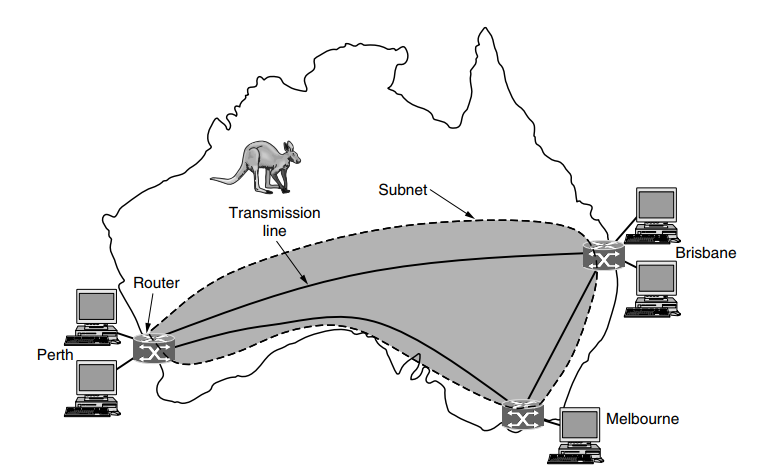
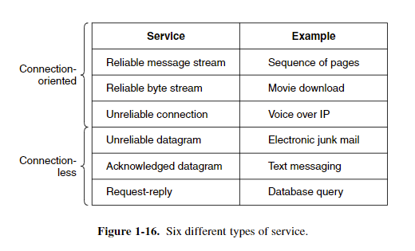
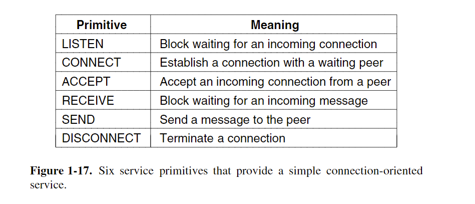
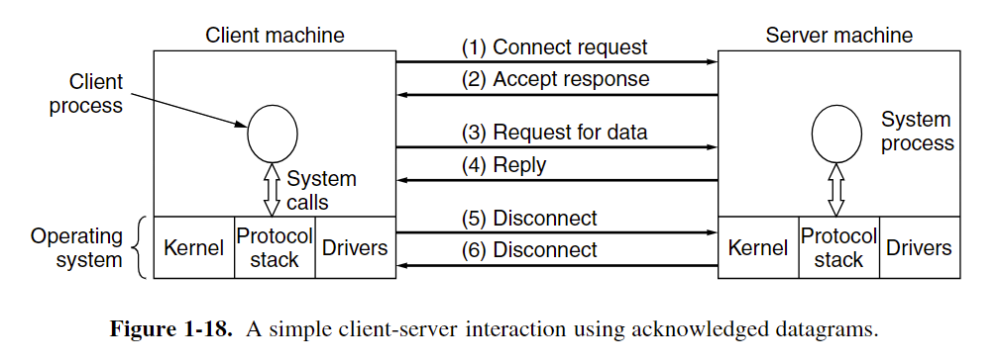
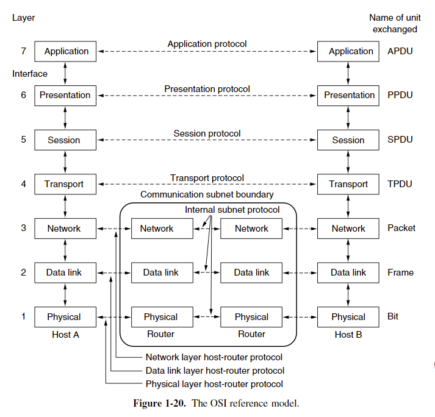
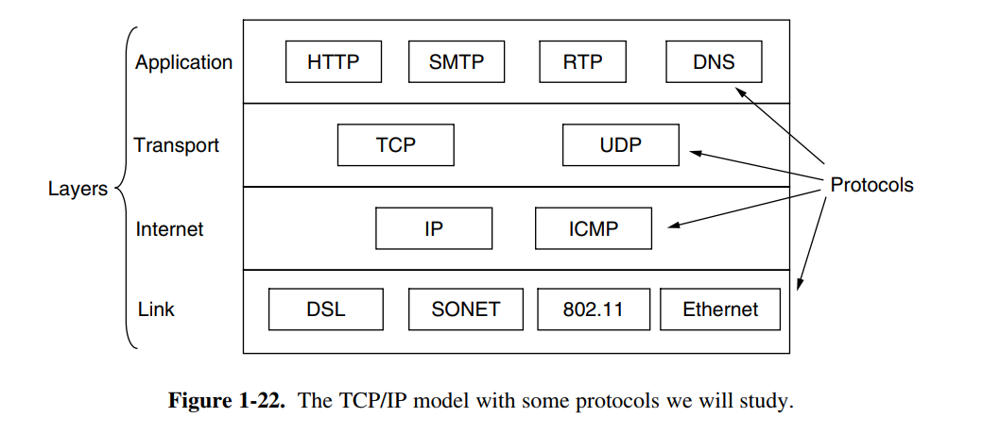

# Chapter 1 Introduction

**middleware**: a layer of software on top of the operating system, is responsible for implementing the interacting model.
**World Wide Web** is the biggest distributed system. It runs on top of the Internet and presents a model in which everything looks like a document (Web page)  

## 1.1 Use of computer networks

#### Home Applications
**Pear to pear communication Applications**: 
Person and remote database
electronic commerce
person-to-person communication
entertainment
ubiquitous computing

#### 1.1.4 social issues

**network neutrality** : the same content should be treated similarly
network can spread movies or music easily, but the copyright firm may be threatened by it

## 1.2 Network Hardware

two important dimensions: **transmission technology and scale**
transmission technology: **broadcast** and **point-to-point**

**P2P**: exactly one sender and exactly one receiver is called **unicasting**
**Broadcast**

### PAN

PC and its wire or wireless peripherals

### LAN (Local Area Networks)

Wired Lan:802.3 Ethernet
Wireless Lan: IEEE 802.11 (WIFI)

classic Ethernet: every packet is in a queue and can not be sent at a same time.

wireless and wired broadcast network can be divided into **static** and **dynamic designs.**
**dynamic design**: model: cellular  dynamic design can be divided into centralized or decentralized. centralized is put the packet in inner order of algorithm.

Home Lan:

1. easy to install
2. network and devices has to foolproof to install
3. low price
4. easy to expand
5. security and reliability

### WAN 

In most WANs, the subnet consists of two distinct components: **transmission lines ** and **switching elements**. Transmission lines move bits between machines. 
Most companies do not have transmission lines lying about, so instead they lease the lines from a telecommunications company.
Switching elements, or just **switches**, are specialized computers that connect two or more transmission lines. When data arrive on an incoming line, the switching element must choose an outgoing line on which to forward them. 
These switching computers have been called by various names in the past; the name **router** is now most commonly used. 

The difference between LAN and WAN:

1. Usually in a WAN, the hosts and subnet are owned and operated by different people.
2. A second difference is that the routers will usually connect different kinds of networking technology.
3.  final difference is in what is connected to the subnet

### 1.2.5 Internetworks

## 1.3 Network Software

Network is bound with the hardware and the software

### 1.3.1 Protocol Hierarchies(协议层次结构)

 **Protocol** is  an agreement between the communicating parties on how communication is to proceed.(P29)
The entities comprising the corresponding layers on different machines are called **peers**.
Between each pair of adjacent layers is an **interface**.(P30)

### 1.3.2 Design Issues for the Layers

Protocol is 

### 1.3.3 Connection-Oriented Versus Connectionless Service

Layers can offer two different types of service to the layers above them: **connection-oriented** and **connectionless**

#### connection-oriented

the service user first establishes a connection, uses the connection, and then releases the connection.

#### connectionless

Connection service is modeled after postal system.
Each message carries the full destination address and **each one is routed through the** **intermediate nodes inside the system independent of all the subsequent messages.**(P35)

**store-and-forward switching**: intermediate nodes receive a message in full before sending it on to the next node.
**cut-through switching**: Before the message is completely received and the onward transmission of a message at a node start

#### datagram service

it does not return an  acknowledgement to the sender.

#### acknowledged datagram service

return an acknowledge to the sender
party invitation.

#### request-reply service

send datagram containing a request and reply contains the answer.

### 1.3.4 Service Primitives

### 1.3.5 The Relationship of Services to Protocols

**Service** is a set of primitives that a layer provides to the layer above it.

**The service and the protocol are completely decoupled.**
Entities use protocols to implement their service definitions. 
Entities are free to change their protocols at will, provided they do not change the service visible to their users.

实体(entity) 表示任何可发送或接收信息的硬件或软件进程。
协议是控制两个对等实体进行通信的规则的集合。
在协议的控制下，两个对等实体间的通信使得本层能够向上一层提供服务。
要实现本层协议，还需要使用下层所提供的服务。
本层的服务用户只能看见下一层的服务而无法看见下面的协议。
下面的协议对上面的服务用户是透明的。
协议是“水平的”，即协议是控制对等实体之间通信的规则。
服务是“垂直的”，即服务是由下层向上层通过层间接口提供的。

## 1.4 Reference Models

OSI protocol not used anymore, but the model is general and valid.

TCP/IP protocol used a lot, but the model do not used.

### 1.4.1 The OSI Reference Model

**OSI: Open system interaction**

1. A layer should be created where a different abstraction is needed.
2.  Each layer should perform a well-defined function.
3.  The function of each layer should be chosen with an eye toward defining internationally standardized protocols.
4. he layer boundaries should be chosen to minimize the information flow across the interfaces.
5. he number of layers should be large enough that distinct functions need not be thrown together in the same layer out of necessity and small enough that the architecture does not become unwieldy.

#### The Physical Layer 物理层

The physical layer is concerned with transmitting raw bits over a communication channel.

#### The Data Link Layer 数据链路层

The main task of the data link layer is to transform a raw transmission facility into a line that appears free of undetected transmission errors.

#### The Network Layer 网络层

The network layer controls the operation of the subnet.
Start of each conversation.
Handling congestion.
the quality of service

#### The Transport Layer 传输层

Accept data from above the layer, split it up into smaller units if need be, pass these to the network layer, split it up into smaller units if need be, pass these to the network layer, and ensure that the pieces all arrive correctly at the other end. All this must be done efficiently and in a way that isolates the upper layers from the inevitable changes in the hardware technology over the course of the time.

Determine what type of service to provide to the session layer and to the users  of the network.

true end-to-end layer

#### The Session Layer 会话层

Allow users on different machines to establish sessions between them.

#### The Presentation Layer 表现层

Concerned with the syntax and semantics of the information transmitted. Manages the abstract data structures and allows higher-level data structures to be defined and exchanged.’

#### The Application Layer 应用层

Contains a variety of protocols that are commonly needed by users

### 1.4.2 The TCP/IP Reference Model

A flexible architecture was needed

packet-switching network 分组交换网络

#### The Link Layer  链路层

Describes what links such as serial lines and classic Ethernet must do to meet the needs of the connectionless internet layer

#### The Internet Layer Internet网络层

Permit hosts to inject packets into any network and have them travel independently to the destination.

#### The Transport Layer 传输层

Allow  peer entities on the source and destination hosts to carry on a conversation, just as in the OSI transport layer.

##### TCP

reliable connection-oriented protocol
Allow a byte stream originating on one machine to be delivered without error on any other machine in the internet
use flow control
make sure a fast sender cannot swamp a slow receiver with more messages than it  can handle

##### UDP

Use user’s own flow control

#### The Application Layer 应用层

Include any session and presentation functions, the user need network service will be showed at here.

# The Physical Layer

The physical layer defines the electrical, timing and other interfaces by which bits are sent as signals over channels.

## 2.1 The Theoretical Basis for Data Communication

## 2.1.1 Fourier Analysis 傅里叶分析

2-1

## 2.1.2 Bandwidth-Limited Signals 带宽限制信号？

**bandwidth**: The width of the frequency range transmitted without being strongly attenuated is called the **bandwidth**.

**baseband**: signals that run from 0 up to a maximum frequency are called baseband signals.

**passband**:Signals that are shifted to occupy a higher range of frequencies, as is the case for all wireless transmissions, are called passband signals

## 2.2 Guided Transmission Meida

### 2.2.1 Magnetic Media

expensive but efficient

### 2.2.2 Twisted Pairs

two insulated copper wires, typically about 1mm thick.

When the wires are twisted, the waves from different twists cancel out, so the wire radiates less effectively.

**Category 5**: A category 5 twisted pair consists of two insulated wires gently twisted together. Four such pairs are typically grouped in a plastic sheath to protect the wires and keep them together.

**full-duplex**: 全双工线 can transmit data two directions at the same time.

**half-duplex**: can transmit data one direction at the same time

**simplex**: only one direction

### 2.2.3 Coaxial Cable

has been replaced by fiber optics on longhaul routes

# 4 The Medium Access Control(MAC) Sublayer

**broadcast channels** are sometimes referred to as **multiaccess channels** or **random access channels**

This chapter mainly told how to allocate the channels.

## 4.1 The Channel Allocation Problem

conference call chaos. Who can talk at same time?

### 4.1.1 Static Channel Allocation

FM band

the amount of senders is small.

